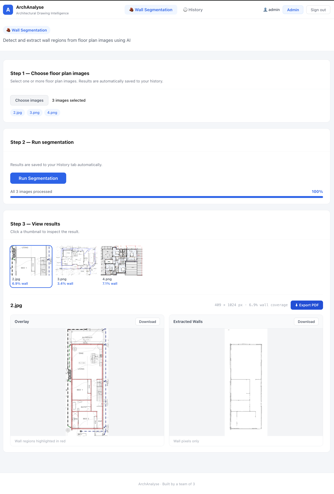
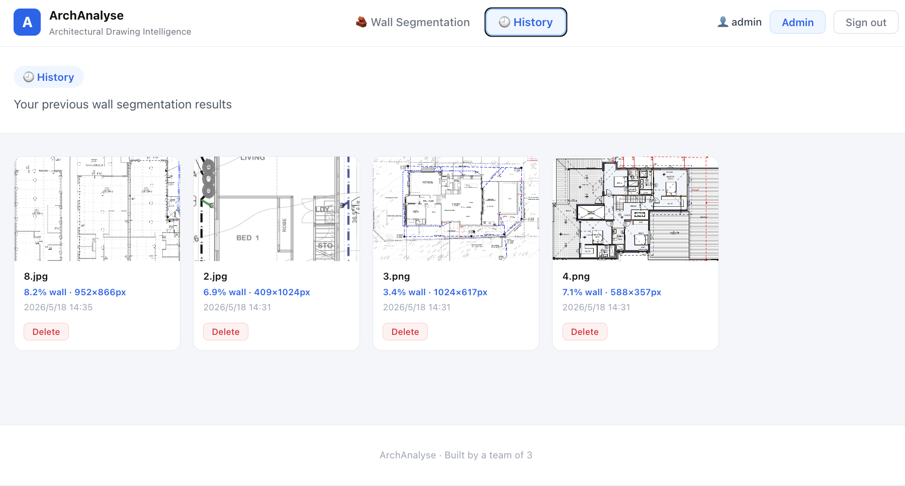
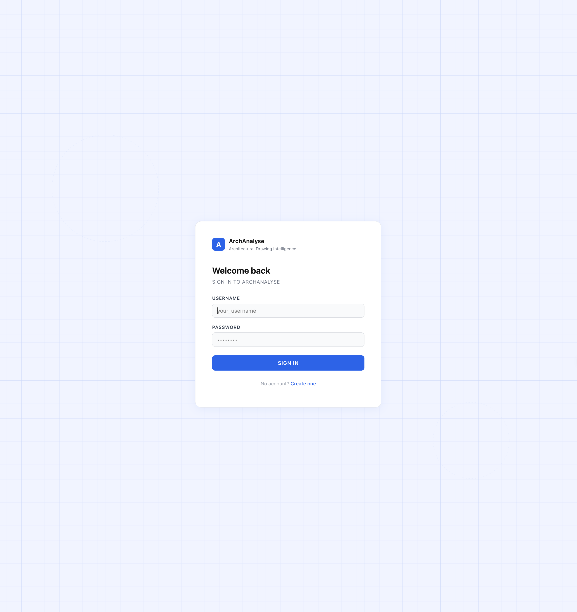

# ArchAnalyse — Architectural Drawing Intelligence System

A web application that helps structural engineers analyse architectural floor plans using deep learning. Built by a team of 3.

**Hiking (Huaiqin) Shi · Boning Zhang · Luna (Ruitong) Zhang**

---

## Overview

ArchAnalyse applies a fine-tuned **SegFormer-B2** model to detect and extract wall regions from floor plan images, achieving **81.3% mIoU** on the CubiCasa5K dataset. The system includes user authentication, batch processing with real-time progress streaming, segmentation history, and PDF export.

---

## Screenshots







---

## Tech Stack

| Layer | Technologies |
|---|---|
| Frontend | React 19, React Router, Vite |
| Backend | FastAPI, SQLAlchemy, SQLite, JWT |
| ML | SegFormer-B2, mmcv 2.1.0, mmsegmentation, PyTorch |
| Infrastructure | Docker, Docker Compose |

---

## Project Structure

```
.
├── backend/
│   ├── app.py                      # API routes
│   ├── auth.py                     # JWT authentication
│   ├── models.py                   # SQLAlchemy ORM models
│   ├── database.py                 # Database configuration
│   ├── export_pdf.py               # Segmentation PDF export
│   ├── segformer_b2_wall.py        # Model configuration
│   ├── requirements.txt
│   ├── tests/                      # 86 automated tests
│   │   ├── conftest.py
│   │   ├── test_auth_unit.py
│   │   ├── test_api_auth.py
│   │   ├── test_api_admin.py
│   │   ├── test_api_endpoints.py
│   │   ├── test_app_utils.py
│   │   └── test_services_segformer.py
│   └── services/
│       └── segformer_inference.py
├── src/                            # React frontend
│   ├── App.jsx
│   ├── context/AuthContext.jsx
│   └── pages/
├── docker-compose.yml
├── Dockerfile.backend
├── Dockerfile
├── start.sh                        # macOS / Linux launcher
├── start.bat                       # Windows launcher
└── .env.example
```

---

## Quick Start (Docker)

**Prerequisites:** Docker Desktop 4.x or Docker Engine 24+

```bash
# macOS / Linux
chmod +x start.sh
./start.sh

# Windows
start.bat
```

The script auto-detects GPU availability and prompts:

```
[1] Auto-detect  (GPU if available, otherwise CPU)
[2] GPU only     (requires NVIDIA CUDA 11.8)
[3] CPU only
```

Once running, open **http://localhost** in your browser.

> Default admin login: see `.env.example` — change credentials before deploying.

---

## Model Weights

The SegFormer checkpoint (`backend/best_mIoU_iter.pth`) is not included in this repository due to file size (~100 MB).

Download and place it at `backend/best_mIoU_iter.pth` before starting.

---

## Configuration

Copy `.env.example` to `.env` and fill in the values:

```bash
cp .env.example .env
```

Key variables:

| Variable | Description |
|---|---|
| `SECRET_KEY` | JWT signing secret — set a strong random value in production |
| `ADMIN_USERNAME` | Initial admin account username |
| `ADMIN_PASSWORD` | Initial admin account password |
| `SEG_CHECKPOINT` | Path to `best_mIoU_iter.pth` |
| `SEG_DEVICE` | `cpu` or `cuda:0` |

---

## API Endpoints

| Method | Endpoint | Description |
|---|---|---|
| GET | `/health` | Health check |
| POST | `/api/auth/register` | Register a new user |
| POST | `/api/auth/login` | Login and receive JWT token |
| GET | `/api/auth/me` | Get current user info |
| GET | `/api/admin/users` | List all users (admin only) |
| POST | `/api/admin/approve/{id}` | Approve a pending user (admin only) |
| DELETE | `/api/admin/users/{id}` | Delete a user (admin only) |
| POST | `/api/segment` | Segment walls in a single image |
| POST | `/api/segment-batch` | Batch segmentation with streaming progress |
| GET | `/api/history` | Get segmentation history |
| DELETE | `/api/history/{id}` | Delete a history record |
| GET | `/api/history/{id}/pdf` | Export a history record as PDF |
| POST | `/api/export-segment-pdf` | Export a live result as PDF |

Full interactive docs available at **http://localhost:8000/docs**

---

## Testing

```bash
cd backend
pip install -r requirements.txt -r requirements-test.txt
pytest
```

| Module | What it covers | Tests |
|---|---|---|
| `test_auth_unit.py` | JWT, password hashing, user lookup | 14 |
| `test_api_auth.py` | register / login / `/me` | 13 |
| `test_api_admin.py` | user approval and deletion | 14 |
| `test_api_endpoints.py` | health, history, segment, PDF export | 10 |
| `test_app_utils.py` | filename sanitisation, image saving | 14 |
| `test_services_segformer.py` | segformer inference utilities | 21 |
| **Total** | | **86** |

Tests use an in-memory SQLite database and mock the ML model, so no GPU or checkpoint is required.

Coverage report:

```bash
pytest --cov=. --cov-report=term-missing
```

| Module | Coverage |
|---|---|
| `auth.py` | 98% |
| `models.py` | 100% |
| `app.py` | 70% |
| `services/segformer_inference.py` | 66% |
| **Overall** | **82%** |

---

## Manual Setup (without Docker)

```bash
# Backend
cd backend
pip install -r requirements.txt
# Install mmcv and mmsegmentation — versions must match your PyTorch + CUDA:
pip install -U openmim
mim install mmcv==2.1.0
mim install mmsegmentation
uvicorn app:app --reload --port 8000

# Frontend (separate terminal)
npm install
npm run dev
```

Frontend: http://localhost:5173 · Backend API: http://localhost:8000